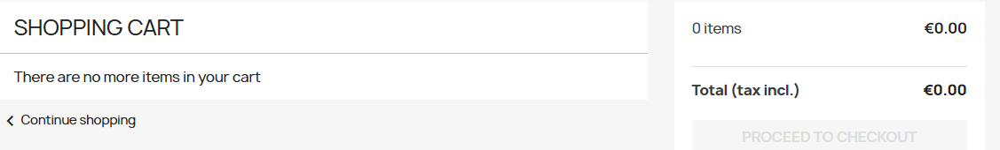

# Rapport d'exécution des tests

## TC-01 – Inscription utilisateur

##### Statut:
PASS

##### Résultat obtenu:
Le compte utilisateur est créé avec succès et l'utilisateur est connecté.

---

## TC-02 – Connexion utilisateur

##### Statut:
PASS

##### Résultat obtenu:
L'utilisateur peut se connecter avec son email et son mot de passe.

---

## TC-03 – Ajouter produit au panier

##### Statut:
PASS

##### Résultat obtenu:
Le produit est ajouté au panier avec succès.

##### Capture d'écran:

---

## TC05 – Supprimer produit du panier

##### Statut:
PASS

##### Résultat obtenu:
Le produit est supprimé du panier et le panier est mis à jour.

##### Capture d'écran:

