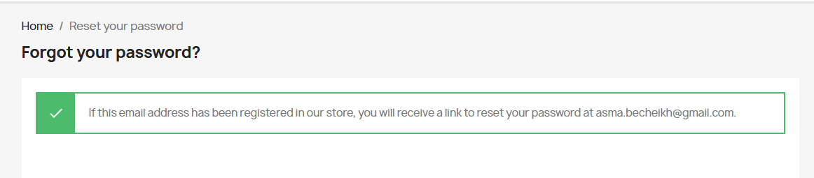
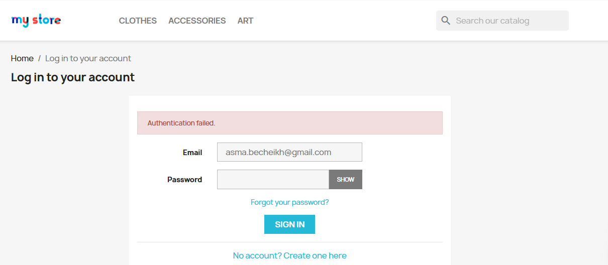

# Rapport des bugs

## Bug ID: BUG-01

#### Titre
Le bouton "Add to cart" ne met pas à jour le panier immédiatement

#### Description
Après avoir cliqué sur "Add to cart", le compteur du panier ne se met pas à jour automatiquement.

#### Étapes pour reproduire
1. Accéder à la page d'accueil
2. Ouvrir un produit
3. Cliquer sur "Add to cart"

#### Résultat attendu
Le produit doit être ajouté au panier immédiatement.

#### Résultat obtenu
Le panier ne se met pas à jour immédiatement.

#### Sévérité
Moyenne

#### Environnement
Application : Site de démonstration PrestaShop
Navigateur : Google Chrome  
Système d'exploitation : Windows 10

---

## Bug ID: BUG-02

#### Titre
L’email de réinitialisation du mot de passe n’est pas reçu après la demande de récupération.

#### Description
Lorsque l’utilisateur utilise la fonctionnalité Forgot Password, le système affiche un message indiquant qu’un email de réinitialisation a été envoyé. Cependant, aucun email n’est reçu dans la boîte mail de l’utilisateur.

#### Étapes pour reproduire
1. Accéder à la page d’accueil du site.
2. Cliquer sur Forgot your password?
3. Saisir une adresse email valide.
4. Cliquer sur Retrieve password.

#### Résultat attendu
Le système doit envoyer un email contenant un lien de réinitialisation du mot de passe à l’adresse email fournie.

#### Résultat obtenu
Un message de confirmation indique que l’email a été envoyé, mais aucun email de réinitialisation n’est reçu dans la boîte mail de l’utilisateur.

#### Sévérité
Moyenne

#### Environnement
Application : Site de démonstration PrestaShop
Navigateur : Google Chrome  
Système d'exploitation : Windows 10
Connexion internet active

##### Capture d'écran:

---

## Bug ID: BUG-03

#### Titre
Message d’erreur de connexion non suffisamment explicite

#### Description
Lorsque l’utilisateur tente de se connecter avec des identifiants incorrects, le système affiche uniquement le message “Authentication failed.”. Ce message est générique et ne fournit pas d’informations supplémentaires sur la cause de l’échec de la connexion.

#### Étapes pour reproduire
1. Accéder à la page Sign in.
2. Saisir une adresse email
3. Saisir un mot de passe incorrect.
4. Cliquer sur Sign in.

#### Résultat attendu
Le système devrait afficher un message d’erreur plus informatif, par exemple :

"Email ou mot de passe incorrect."
ou

"Les identifiants saisis sont invalides. Veuillez vérifier votre email et votre mot de passe."

#### Résultat obtenu
Le système affiche uniquement le message : “Authentication failed.”, sans préciser la cause de l’erreur.

#### Sévérité
Faible

#### Environnement
Application : Site de démonstration PrestaShop
Navigateur : Google Chrome  
Système d'exploitation : Windows 10

##### Capture d'écran:

